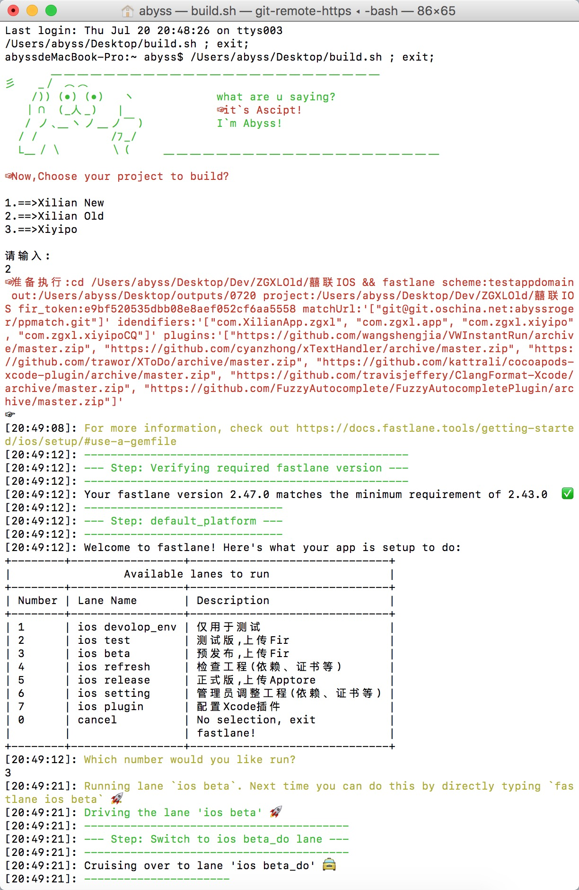

# AScript (Abyss`s Script)

一个很懒的程序员的脚本集。
A lazy programmer`s scripts.

[TOC]
## build

- [x] IOS自动构建项目(pod install/git pull/version&build increment/build)
- [x] 分类管理历史包备份
- [x] 分发Appstore与各个平台
- [x] 邮件通知
- [ ] Android支持

**仅仅执行一条‘build’**

